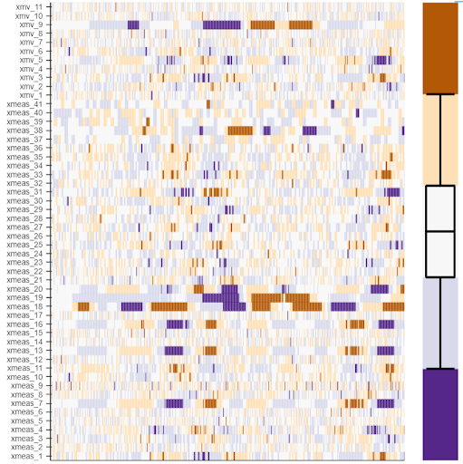

# Box-Plot Heatmap for Fault Detection in Multi Dimensional Data

*For the sake of Non-disclosure of data, only a brief README will be provided. The data and the code built around using it won't be disclosed.*

## Problem we wish to solve

How can one visualize (time-)series data of N different variables with very different ranges and recorded under "faulty" and "non-faulty" conditions?

## Solution

- Firstly, for each variable, we divide the "non-faulty" data into ranges based on how a box plox would divide it. This data-ranges bin the data and convert it to ordinal data. This ordinal data disregards the original ranges of individual variables and brings all the variables to a common box plot based ordinal scale.
- Now, we can use the **same** box plot based ranges / bins to convert even the "faulty" data into ordinal data.
- Visualizing these ordinal versions of "faulty" and "non-faulty" data on heatmap (matrix) could give us different heatmaps since the ordinal data is based only on the distribution of "non-faulty" data. This can help us differentiate between the two conditions.

## Example

This is a "faulty" data heatmap. The data has around 50 variables.

As shown, the box-plot organizes the data into 5 bins which serves as our color map. The regions of red and blue show when particular variables deviate from their "non-faulty" distribution.
